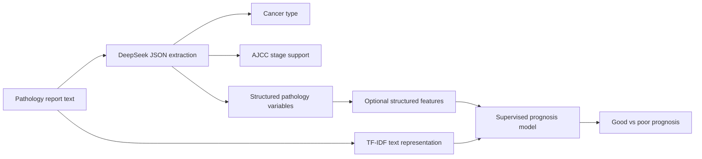
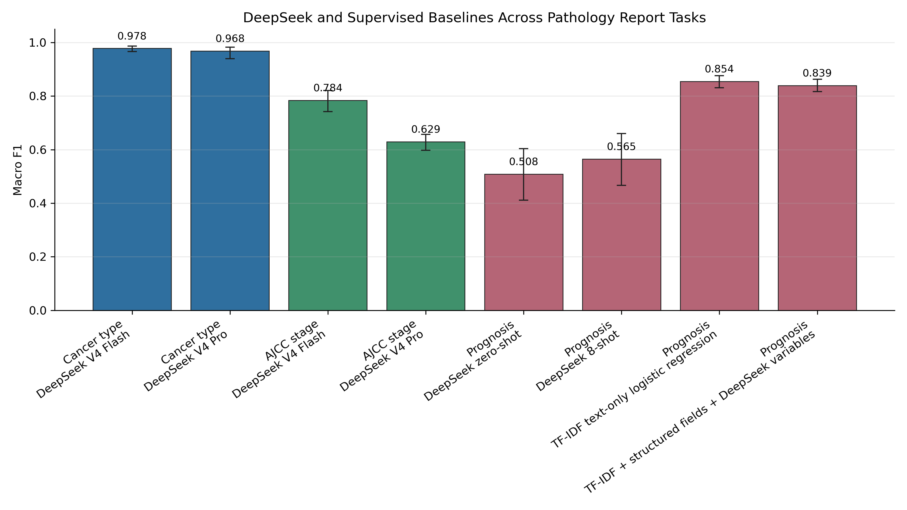

# DeepSeek for Pathology Report Understanding: Strengths and Limitations Across Extraction, Staging, and Prognosis Tasks

## Title Page

**Title:** DeepSeek for Pathology Report Understanding: Strengths and Limitations Across Extraction, Staging, and Prognosis Tasks

**Short title:** DeepSeek pathology report understanding

**Authors:** Mohamed Kone1, Shulin Wang1*, Gaoussou Haidara1

**Affiliations:** 1*School of Computer Science and Engineering, Hunan University, Changsha, China.

**Corresponding author:** Shulin Wang. E-mail: books@hnu.edu.cn.

## Abstract

### Background

Pathology reports contain diagnosis, staging, and prognostic information that is essential for cancer research and clinical decision support. However, these reports are written as unstructured text, which limits scalable reuse in computational oncology. Recent benchmarks have shown that large language models can extract cancer type and staging information from pathology reports, but it remains unclear whether general-purpose reasoning models can also support prognosis prediction or whether supervised outcome models remain preferable for that task.

### Methods

We conducted an independent benchmark of DeepSeek on PathRep-Bench style pathology report understanding tasks derived from The Cancer Genome Atlas pathology reports. The dataset contained 9,523 reports split into 7,618 training, 953 validation, and 952 test reports. We evaluated DeepSeek V4 Flash and DeepSeek V4 Pro for cancer type identification and high-level AJCC stage prediction using JSON-constrained prompting. Cancer type identification used non-reasoning JSON prompting, whereas AJCC staging and prognosis prompting used reasoning-mode prompting. Prognosis labels were defined as good when disease-specific survival exceeded the cancer-type mean disease-specific survival threshold and poor otherwise. We also trained local TF-IDF logistic regression models for prognosis prediction and tested whether DeepSeek-extracted structured pathology variables improved supervised prognosis modeling.

### Results

DeepSeek V4 Flash achieved 0.9800 accuracy (95% CI, 0.9695-0.9884) and 0.9778 macro F1 (95% CI, 0.9660-0.9867) for cancer type identification across 952 test reports. For AJCC stage prediction, DeepSeek V4 Flash achieved 0.8165 accuracy (95% CI, 0.7845-0.8468) and 0.7841 macro F1 (95% CI, 0.7421-0.8201) on 594 labeled test reports. DeepSeek V4 Pro did not significantly improve accuracy over Flash for either cancer type identification or AJCC staging by McNemar testing, and produced 14 empty final outputs during AJCC staging under the tested completion budget. DeepSeek prognosis prompting was weak on a 100-report subset, improving from 0.5300 accuracy and 0.5083 macro F1 in zero-shot mode to 0.5700 accuracy and 0.5647 macro F1 with eight few-shot examples. In contrast, a supervised TF-IDF text-only logistic regression classifier achieved 0.8571 accuracy (95% CI, 0.8351-0.8792) and 0.8543 macro F1 (95% CI, 0.8312-0.8764) on the full 952-report test set. Adding DeepSeek-extracted structured variables reduced macro F1 to 0.8394.

### Conclusions

DeepSeek is highly effective for pathology information extraction and provides strong AJCC staging support with reasoning-mode prompting. However, prognosis prediction is better framed as a supervised outcome modeling problem. Although the TF-IDF text-only model achieved the highest prognosis point estimate, adding DeepSeek-extracted variables did not produce a statistically significant improvement. These findings suggest that raw pathology report text already captures much of the prognostic information available in this benchmark dataset under the evaluated modeling framework and support a hybrid architecture in which DeepSeek is used for extraction and staging support, while dedicated supervised models are used for prognosis prediction.

**Keywords:** pathology reports; large language models; DeepSeek; cancer staging; AJCC; prognosis; TCGA; natural language processing

## Background

Pathology reports are among the most information-rich documents in oncology. They summarize tumor histology, tissue site, grade, resection status, nodal involvement, metastatic findings, biomarker context, and in many cases explicit stage group. These reports are central to cancer diagnosis and treatment planning, but they are typically stored as free text. This makes large-scale reuse difficult for cohort construction, registry enrichment, outcomes research, and clinical trial screening.

Recent progress in large language models (LLMs) has made pathology report understanding more feasible. Unlike earlier rule-based systems or narrow named-entity recognition pipelines, LLMs can interpret varied report formats, follow label-constrained instructions, and produce structured outputs from heterogeneous text. PathRep-Bench established a useful benchmark for evaluating this capability across three clinically relevant tasks: cancer type identification, AJCC stage identification, and prognosis assessment from pathology reports. The benchmark highlights a natural difficulty gradient. Cancer type identification is often a direct extraction task. AJCC stage identification requires more reasoning over explicit stage statements, tumor extent, lymph nodes, and metastasis evidence. Prognosis prediction is still more difficult because it requires mapping report information to future clinical outcome.

DeepSeek is an attractive model family for this setting because it provides long-context, OpenAI-compatible API access, JSON output support, and low-cost inference options. However, its utility for pathology report understanding has not been independently characterized on the PathRep-Bench tasks. In particular, it is important to know whether a larger DeepSeek model improves performance enough to justify higher cost, and whether LLM-extracted variables add prognostic value beyond raw report text.

This study evaluates DeepSeek across extraction, staging, and prognosis tasks using PathRep-Bench style TCGA pathology report splits. Our central hypothesis is that LLMs and supervised outcome models serve different roles. LLMs should excel at flexible information extraction and staging support, while prognosis prediction should benefit most from supervised learning directly optimized against outcome labels.

## Related Work

Pathology NLP has historically relied on rule-based extraction, dictionary matching, and task-specific machine-learning models. These systems can perform well when target labels and document formats are stable, but they often require substantial adaptation across institutions and report templates. Transformer-based biomedical language models improved contextual representation learning, yet many systems still require task-specific annotation and fine-tuning. Clinical NLP benchmarks such as BLUE and BLURB helped standardize evaluation across biomedical and clinical text tasks, and domain-pretrained models such as PubMedBERT and BioGPT showed the value of biomedical corpora for language-model pretraining.

Recent biomedical LLM work has broadened from representation learning to instruction following, tool use, and clinical reasoning. Med-PaLM demonstrated that large instruction-tuned models can encode clinically useful knowledge for medical question answering. GeneGPT and related tool-augmented systems showed that LLMs can improve biomedical reasoning by calling domain resources instead of relying only on parametric knowledge. GPTCelltype and other LLM-assisted biology workflows suggest that general-purpose LLMs can support expert annotation tasks, although such systems still require careful validation and task-specific evaluation.

Pathology-specific LLM research has developed along two related but distinct tracks. One track focuses on pathology images and multimodal assistants, including foundation models and conversational systems for histopathology image interpretation. Another track focuses on pathology report text, where the central problems are document understanding, label extraction, staging normalization, and outcome prediction. These report-understanding tasks are especially important because pathology text is already available at scale in many cancer datasets, but its free-text format makes direct computational reuse difficult.

The PathRep-Bench study moved the field toward broader evaluation of LLMs for pathology report understanding by combining TCGA pathology report text with cancer type, stage, and survival-derived labels. That work showed that cancer type identification can reach very high performance, that staging benefits from model scale and instruction tuning, and that prognosis remains challenging. The present study extends this line of work by evaluating DeepSeek as an independent model family and by adding a practical cost and hybrid-prognosis analysis.

This study also relates to a broader distinction between information extraction and outcome prediction. Information extraction asks whether a model can recover facts already present in text. Outcome prediction asks whether the available information, after representation and modeling, can predict a future clinical endpoint. The latter is not guaranteed to improve simply because an LLM extracts plausible clinical variables; extracted variables may omit weak but useful signals present in the raw text, and compressed structured representations may lose prognostic information.

## Methods

### Dataset

We used the public PathRep-Bench data derived from TCGA pathology reports. The prepared dataset contained 9,523 pathology reports with fixed train, validation, and test splits: 7,618 training reports, 953 validation reports, and 952 test reports. Each row included pathology report text, cancer type, AJCC stage fields where available, disease-specific survival time, and derived prognosis labels.

For cancer type identification, all 952 test reports had labels. For AJCC staging, 594 of the 952 test reports had usable high-level stage labels after excluding reports with missing stage labels. For prognosis, all 952 test reports had derived good or poor labels. The prognosis label was computed by cancer type: reports were labeled good if disease-specific survival time exceeded the cancer-type mean disease-specific survival threshold and poor otherwise. The mean threshold was estimated from the training split by cancer type, with fallback to all rows only if needed for a cancer type without training examples.

### Tasks

We evaluated three tasks.

**Cancer type identification:** Given the pathology report text, the model selected one label from 32 allowed TCGA cancer types.

**AJCC stage identification:** Given the pathology report text, the model selected one of four high-level stage groups: Stage I, Stage II, Stage III, or Stage IV. The prompt instructed the model to map substages such as Stage IIA, Stage IIIB, or Stage IVA to the corresponding high-level stage group.

**Prognosis prediction:** Given the pathology report text, cancer type, and cancer-type mean disease-specific survival threshold, the model predicted good or poor prognosis. This was treated as a retrospective benchmark task and not as clinical advice.

### DeepSeek Prompting Framework

All DeepSeek calls used JSON-constrained prompting through the chat completions API. The system instruction required valid JSON only, with no markdown or extra keys. The response format was set to JSON object mode. Cancer type identification used non-reasoning mode because the answer is usually directly stated in the report. AJCC staging and prognosis prompting used reasoning mode because these tasks require synthesizing stage evidence or outcome-relevant findings.

For cancer type identification, the prompt supplied the complete list of 32 allowed cancer type labels and asked the model to return:

```json
{"cancer_type": "<one allowed label>"}
```

For AJCC staging, the prompt supplied the four allowed high-level stage labels and instructed the model to use explicitly stated pathologic stage when available, to map substages to their high-level group, and otherwise to infer the best supported stage using tumor extent, nodal involvement, and distant metastasis evidence. The expected output was:

```json
{"ajcc_stage": "<one allowed label>"}
```

For prognosis, the prompt supplied cancer type, the mean disease-specific survival threshold, and the pathology report. Zero-shot prognosis used no examples. Few-shot prognosis used eight training examples selected from the training split, balanced across good and poor labels. The expected output was:

```json
{"prognosis": "good"}
```

or

```json
{"prognosis": "poor"}
```

### DeepSeek Model Comparison

We compared DeepSeek V4 Flash and DeepSeek V4 Pro for cancer type identification and AJCC stage identification. For AJCC staging, both models were run with a 4,096 completion-token budget. Model output failures, including empty final responses and unparseable JSON, were counted as errors in the primary analysis.

### Prognosis Machine-Learning Baselines

We trained local logistic regression prognosis classifiers using the training and validation splits for training and the held-out test split for evaluation. The text-only model used TF-IDF features over pathology report text with lowercasing, English stop-word removal, unigrams and bigrams, sublinear term frequency, a minimum document frequency of 2, and a maximum of 50,000 features. Logistic regression used balanced class weights, the liblinear solver, C = 2.0, maximum 3,000 iterations, and a fixed random seed.

We evaluated six prognosis feature sets:

1. TF-IDF report text only.
2. TF-IDF report text plus original structured fields.
3. TF-IDF report text plus original structured fields plus DeepSeek-extracted variables.
4. Original structured fields plus DeepSeek-extracted variables without report text.
5. DeepSeek-extracted variables only.
6. Original structured fields only.

### DeepSeek-Extracted Variables for Hybrid Prognosis

To test whether LLM extraction could improve prognosis modeling, we used DeepSeek V4 Flash to extract structured variables from all training, validation, and test reports. The extraction schema included cancer type, AJCC stage, tumor size, positive nodes, examined nodes, distant metastasis, margin status, lymphovascular invasion, grade, necrosis, and key evidence phrases. Variable extraction used non-reasoning JSON prompting and was resumable. The final extraction covered 9,523 reports with 9 model-output errors.

The extracted variables were then converted into sparse dictionary features and added to the logistic regression prognosis pipeline. This evaluated whether DeepSeek-derived structure adds information beyond raw report text and existing structured fields.

### Cost Analysis

We estimated inference cost using recorded token usage from each run and the DeepSeek pricing table used by the analysis scripts. When cache-hit and cache-miss counts were unavailable, prompt tokens were conservatively priced as cache misses. We report estimated cost per report, cost per 1,000 reports, and cost per correct prediction.

### Evaluation Metrics

We report accuracy and macro F1. Macro F1 was emphasized because the prognosis labels were imbalanced and because staging performance can vary across classes. For DeepSeek prompting, unparseable outputs and empty model outputs were counted as model errors. For labeled tasks, model errors were included as incorrect predictions in the primary metrics.

### Statistical Analysis

We estimated 95% confidence intervals using nonparametric bootstrap resampling over reports with 2,000 bootstrap iterations and a fixed random seed. Accuracy and macro F1 confidence intervals were computed by resampling the evaluated reports with replacement and recalculating the metric for each bootstrap sample. For paired model comparisons on the same reports, predictions were aligned by original row index. We used exact McNemar tests for paired accuracy comparisons and paired bootstrap differences for macro F1. Bootstrap comparison p values were computed as two-sided sign-crossing probabilities over the paired bootstrap distribution.

## Results

### Cancer Type Identification

DeepSeek V4 Flash achieved near-ceiling performance for cancer type identification, correctly classifying 933 of 952 test reports. Accuracy was 0.9800 (95% CI, 0.9695-0.9884) and macro F1 was 0.9778 (95% CI, 0.9660-0.9867). There were no model-output errors.

DeepSeek V4 Pro did not improve cancer type identification. It correctly classified 930 of 952 reports, with 0.9769 accuracy (95% CI, 0.9664-0.9863) and 0.9685 macro F1 (95% CI, 0.9394-0.9827). It also had no model-output errors, but its estimated cost was approximately 2.54 times higher than Flash for this task. The paired Flash-versus-Pro accuracy difference was not statistically significant by exact McNemar testing (6 Flash-only correct versus 3 Pro-only correct; p = 0.5078), and the macro F1 difference was not significant by paired bootstrap comparison (delta = 0.0094; 95% CI, -0.0048 to 0.0363; p = 0.2330).

The main remaining cancer-type errors were clinically plausible neighboring-label errors, including rectum adenocarcinoma predicted as colon adenocarcinoma, stomach versus esophageal confusion, and renal cell carcinoma subtype confusion.

### AJCC Stage Identification

DeepSeek V4 Flash achieved strong AJCC staging performance on the 594 test reports with stage labels. It correctly classified 485 reports, yielding 0.8165 accuracy (95% CI, 0.7845-0.8468) and 0.7841 macro F1 (95% CI, 0.7421-0.8201), with no model-output errors.

DeepSeek V4 Pro did not improve the primary AJCC stage result. It correctly classified 481 of 594 labeled reports, yielding 0.8098 accuracy (95% CI, 0.7761-0.8401) and 0.6288 macro F1 (95% CI, 0.5977-0.6573). The Pro run produced 14 empty final responses under the tested 4,096 completion-token budget. These empty outputs were counted as errors in the primary analysis. Among the 580 rows with valid JSON responses, Pro achieved 481 correct predictions, corresponding to 0.8293 accuracy; however, the empty-response reliability issue and higher cost made Flash the better primary model in this study. Flash did not significantly improve paired accuracy over Pro by McNemar testing (28 Flash-only correct versus 24 Pro-only correct; p = 0.6778), but it had significantly higher macro F1 in paired bootstrap analysis (delta = 0.1553; 95% CI, 0.1234 to 0.1843; p < 0.0001), reflecting the effect of Pro output failures and class-level performance differences.

The largest AJCC error mode was under-calling Stage IV as Stage III. There were 24 Stage IV reports predicted as Stage III and 5 Stage III reports predicted as Stage IV. Adjacent-stage confusion also occurred among Stage I, Stage II, and Stage III.

### Prognosis Prompting

DeepSeek prognosis prompting was substantially weaker than extraction and staging. In a 100-report zero-shot run with DeepSeek V4 Flash, the model achieved 0.5300 accuracy (95% CI, 0.4400-0.6300) and 0.5083 macro F1 (95% CI, 0.4114-0.6033). An eight-shot prompt improved performance to 0.5700 accuracy (95% CI, 0.4700-0.6700) and 0.5647 macro F1 (95% CI, 0.4665-0.6599), but this remained far below the supervised prognosis models.

Because prognosis prompting was evaluated on a 100-report subset, these results should be interpreted as a focused prompting analysis rather than a full-test leaderboard. However, the weak performance on this subset motivated the full-test supervised prognosis comparison described below.

### Supervised Prognosis Models

The strongest prognosis model was TF-IDF text-only logistic regression trained on the training plus validation splits and evaluated on the full 952-report test set. It achieved 0.8571 accuracy (95% CI, 0.8351-0.8792) and 0.8543 macro F1 (95% CI, 0.8312-0.8764). The model correctly classified 474 of 572 poor-prognosis cases and 342 of 380 good-prognosis cases.

Adding the original structured fields slightly reduced performance to 0.8529 accuracy and 0.8501 macro F1. Adding DeepSeek-extracted structured variables further reduced performance to 0.8435 accuracy (95% CI, 0.8204-0.8666) and 0.8394 macro F1 (95% CI, 0.8166-0.8630). DeepSeek variables without text were much weaker: original structured fields plus DeepSeek variables achieved 0.6512 macro F1, and DeepSeek variables alone achieved 0.6407 macro F1.

Although the TF-IDF text-only model achieved the highest prognosis point estimate, adding DeepSeek-extracted variables did not produce a statistically significant improvement. The paired difference between TF-IDF text-only and TF-IDF plus structured fields plus DeepSeek variables was not statistically significant by exact McNemar testing (54 TF-IDF-only correct versus 41 DeepSeek-assisted correct; p = 0.2181) or paired bootstrap macro F1 comparison (delta = 0.0149; 95% CI, -0.0047 to 0.0349; p = 0.1490). These results suggest that the raw pathology report text already captures much of the prognostic information available in this benchmark dataset under the evaluated modeling framework.

### Cost Analysis

DeepSeek V4 Flash was consistently more cost-effective than DeepSeek V4 Pro in these experiments. For cancer type identification, Flash cost approximately USD 0.1918 per 1,000 reports, compared with USD 0.4871 per 1,000 reports for Pro. For AJCC staging, Flash cost approximately USD 0.2712 per 1,000 labeled reports, compared with USD 1.1717 per 1,000 labeled reports for Pro.

Full DeepSeek structured variable extraction across train, validation, and test reports cost approximately USD 1.77 for 9,523 reports. Although this extraction cost was low, the resulting variables did not improve prognosis performance over raw text.

## Tables

### Table 1. Main Benchmark Results With 95% Confidence Intervals

| Task | Method | Test rows | Accuracy (95% CI) | Macro F1 (95% CI) | Model errors |
| --- | --- | ---: | --- | --- | ---: |
| Cancer type | DeepSeek V4 Flash, JSON prompting | 952 | 0.9800 (0.9695-0.9884) | 0.9778 (0.9660-0.9867) | 0 |
| Cancer type | DeepSeek V4 Pro, JSON prompting | 952 | 0.9769 (0.9664-0.9863) | 0.9685 (0.9394-0.9827) | 0 |
| AJCC stage | DeepSeek V4 Flash, reasoning mode | 594 | 0.8165 (0.7845-0.8468) | 0.7841 (0.7421-0.8201) | 0 |
| AJCC stage | DeepSeek V4 Pro, reasoning mode | 594 | 0.8098 (0.7761-0.8401) | 0.6288 (0.5977-0.6573) | 14 |
| Prognosis | DeepSeek V4 Flash, zero-shot | 100 | 0.5300 (0.4400-0.6300) | 0.5083 (0.4114-0.6033) | 0 |
| Prognosis | DeepSeek V4 Flash, 8-shot | 100 | 0.5700 (0.4700-0.6700) | 0.5647 (0.4665-0.6599) | 0 |
| Prognosis | TF-IDF text-only logistic regression | 952 | 0.8571 (0.8351-0.8792) | 0.8543 (0.8312-0.8764) | NA |
| Prognosis | TF-IDF + structured fields + DeepSeek variables | 952 | 0.8435 (0.8204-0.8666) | 0.8394 (0.8166-0.8630) | NA |

### Table 2. DeepSeek Cost Analysis

| Run | Model | Reports | Correct | Total tokens | Estimated cost | Cost/report | Cost/1,000 reports | Cost/correct |
| --- | --- | ---: | ---: | ---: | ---: | ---: | ---: | ---: |
| Cancer type | DeepSeek V4 Flash | 952 | 933 | 1,292,828 | USD 0.182611 | USD 0.000192 | USD 0.1918 | USD 0.000196 |
| Cancer type | DeepSeek V4 Pro | 952 | 930 | 1,294,297 | USD 0.463766 | USD 0.000487 | USD 0.4871 | USD 0.000499 |
| AJCC stage | DeepSeek V4 Flash | 594 | 485 | 945,862 | USD 0.161103 | USD 0.000271 | USD 0.2712 | USD 0.000332 |
| AJCC stage | DeepSeek V4 Pro | 594 | 481 | 1,170,725 | USD 0.695980 | USD 0.001172 | USD 1.1717 | USD 0.001447 |
| Prognosis zero-shot | DeepSeek V4 Flash | 100 | 53 | 151,124 | USD 0.024516 | USD 0.000245 | USD 0.2452 | USD 0.000463 |
| Prognosis 8-shot | DeepSeek V4 Flash | 100 | 57 | 386,105 | USD 0.058671 | USD 0.000587 | USD 0.5867 | USD 0.001029 |

### Table 3. Prognosis Ablation Results

| Prognosis model | Accuracy | Macro F1 | Delta vs best |
| --- | ---: | ---: | ---: |
| TF-IDF text only | 0.8571 | 0.8543 | 0.0000 |
| TF-IDF text + original structured fields | 0.8529 | 0.8501 | -0.0042 |
| TF-IDF text + original structured fields + DeepSeek variables | 0.8435 | 0.8394 | -0.0149 |
| Original structured fields + DeepSeek variables | 0.6607 | 0.6512 | -0.2031 |
| DeepSeek variables only | 0.6492 | 0.6407 | -0.2136 |
| Original structured fields only | 0.5578 | 0.5540 | -0.3003 |

### Table 4. Selected Clinically Plausible Error Modes

| Error mode | Gold label | Predicted label | Count |
| --- | --- | --- | ---: |
| Rectum versus colon confusion | Rectum adenocarcinoma | Colon adenocarcinoma | 5 |
| Kidney subtype confusion | Kidney renal papillary cell carcinoma | Kidney renal clear cell carcinoma | 3 |
| Kidney subtype confusion | Kidney renal clear cell carcinoma | Kidney chromophobe | 1 |
| Stage III/IV confusion | Stage III | Stage IV | 5 |
| Stage III/IV confusion | Stage IV | Stage III | 24 |

### Table 5. Paired Statistical Comparisons

| Comparison | n | Delta accuracy | McNemar b/c | McNemar p | Delta macro F1 (95% CI) | Bootstrap p |
| --- | ---: | ---: | --- | ---: | --- | ---: |
| Cancer type: Flash vs Pro | 952 | 0.0032 | 6/3 | 0.5078 | 0.0094 (-0.0048 to 0.0363) | 0.2330 |
| AJCC stage: Flash vs Pro | 594 | 0.0067 | 28/24 | 0.6778 | 0.1553 (0.1234 to 0.1843) | <0.0001 |
| Prognosis: TF-IDF text-only vs DeepSeek-assisted ML | 952 | 0.0137 | 54/41 | 0.2181 | 0.0149 (-0.0047 to 0.0349) | 0.1490 |

## Figure 1. Proposed Hybrid Architecture



**Figure caption:** Proposed role-separated architecture for pathology report understanding. DeepSeek is used for flexible language understanding tasks such as cancer type extraction, AJCC staging support, and structured variable extraction. Prognosis prediction is handled by a supervised outcome model trained directly against survival-derived labels, with raw report text retained as a primary representation.

## Figure 2. Macro F1 Results With 95% Bootstrap Confidence Intervals



**Figure caption:** Quantitative comparison of macro F1 across DeepSeek prompting conditions and supervised prognosis baselines. Error bars show 95% nonparametric bootstrap confidence intervals over evaluated reports. Cancer type identification shows near-ceiling performance for both DeepSeek models, AJCC staging shows stronger Flash macro F1 under the tested completion budget, and prognosis performance is highest for supervised TF-IDF text modeling.

## Error Analysis

The error analysis supports the interpretation that DeepSeek failures are often clinically plausible rather than random.

For cancer type identification, the most prominent pattern was rectum adenocarcinoma predicted as colon adenocarcinoma. This is a plausible confusion because colorectal pathology reports may share terminology, specimen descriptions, and histologic phrasing. A deployment-oriented system could reduce this error by incorporating anatomical site constraints or metadata from the case record.

Kidney cancer subtype errors were also observed, particularly papillary renal cell carcinoma predicted as clear cell carcinoma. This suggests that cancer-type extraction should retain the full differential signal in renal tumors, where subtype terminology may appear in microscopic descriptions, final diagnosis text, or historical context.

For AJCC staging, the most important error mode was Stage IV under-called as Stage III. This matters clinically because Stage IV generally indicates distant metastatic disease, while Stage III commonly reflects advanced local or nodal disease. In some pathology reports, metastatic information may be absent, historical, or described outside the main specimen diagnosis, making this distinction difficult from pathology text alone. Stage III/IV confusion suggests that staging support systems should highlight the evidence used for distant metastasis calls and should be integrated with radiology, operative, and clinical staging data before clinical use.

## Discussion

This study shows a clear role separation for DeepSeek in pathology report understanding. DeepSeek V4 Flash performed extremely well for cancer type identification and strongly for AJCC stage prediction. These are tasks where the desired answer is usually present in the report, although AJCC staging may require normalization from substage to high-level stage group or reasoning over tumor extent, nodal status, and metastasis information.

In contrast, prognosis prediction behaved differently. Prompting DeepSeek directly for good versus poor prognosis produced weak results on a 100-report subset, even after adding eight examples. More importantly, the full-test supervised ablation showed that the highest prognosis point estimate came from raw pathology report text represented with TF-IDF and modeled with logistic regression. Adding DeepSeek-extracted variables did not produce a statistically significant improvement over this text-only model, and DeepSeek-derived structured variables performed substantially worse when used without raw text.

This finding is scientifically useful because it argues against a simplistic view of LLM extraction as a universal improvement. LLMs can extract concise clinical variables, but prognosis prediction may depend on weak, distributed cues across the full report. These cues may include specimen context, wording around extent of disease, negative findings, tumor burden, procedure type, and co-occurring histologic details. A TF-IDF model can exploit many such small textual signals directly, whereas a compact extracted-variable schema may discard them.

The Flash-versus-Pro comparison also has practical implications. DeepSeek V4 Pro did not improve cancer type identification and did not improve the primary AJCC staging result under the tested settings. For AJCC staging, Pro had slightly better valid-response accuracy after excluding empty outputs, but this was offset by 14 empty final responses and substantially higher cost. These results suggest that, for structured pathology extraction and staging support, a cheaper fast model may offer the better cost-performance tradeoff.

The results support a hybrid architecture. DeepSeek should be used where flexible language interpretation is valuable: cancer type extraction, staging support, conversion of reports into structured variables, and possibly evidence highlighting for review. Prognosis prediction should be treated as supervised outcome modeling, preferably using raw report text and, in future work, survival-analysis methods that account for censoring and time-to-event structure.

## Limitations

This study has several limitations. First, it is retrospective and based on public TCGA-derived pathology report data. Performance may differ for contemporary institutional reports, scanned reports, synoptic templates, or reports with different cancer-type distributions.

Second, the prognosis label is a simplified binary endpoint derived from cancer-type mean disease-specific survival. This does not replace formal survival modeling and does not account for censoring in the way a Cox model, random survival forest, or other time-to-event method would.

Third, DeepSeek prognosis prompting was evaluated on a 100-report subset rather than the full test set. The subset result is sufficient to show that direct prompting was weak in the tested setting, but full-set prompting would be needed for a definitive LLM-only prognosis leaderboard.

Fourth, AJCC staging from pathology reports alone is inherently limited. Some stage-defining information, particularly distant metastasis and clinical staging context, may not be present in pathology text. A clinically deployed staging support system should combine pathology text with structured clinical data, radiology, operative notes, and registry fields.

Fifth, DeepSeek V4 Pro was evaluated with a 4,096 completion-token budget for AJCC staging. The 14 empty final responses suggest that a larger completion budget or different reasoning configuration might improve reliability. The primary conclusion is therefore cost-performance under the tested settings, not an absolute statement about the maximum achievable performance of Pro.

Finally, confidence intervals and paired tests were based on bootstrap resampling and exact McNemar tests over the available benchmark rows. These analyses quantify uncertainty in the current test set but do not replace external validation on independent institutional cohorts.

## Clinical Safety Considerations

The models evaluated here should not be used as autonomous clinical decision makers. Cancer type extraction and AJCC staging outputs should be treated as decision-support artifacts requiring clinician review. Prognosis prediction is especially sensitive because it can affect treatment expectations, counseling, and risk stratification. The supervised prognosis models in this study are benchmark models, not validated clinical tools.

For any prospective deployment, model outputs should include evidence snippets, uncertainty estimates, audit logs, and failure handling for missing or conflicting information. Performance should be validated across institutions, report formats, cancer types, demographic groups, and time periods. Clinical integration should prioritize human oversight and clear boundaries between retrospective research classification and patient-specific care.

## Conclusions

DeepSeek V4 Flash is a strong and cost-effective model for pathology report understanding. It achieved near-ceiling cancer type identification and strong AJCC staging performance using JSON-constrained prompting. DeepSeek V4 Pro did not improve performance enough to justify its higher cost in the tested settings.

Prognosis prediction remained the main limitation. Direct DeepSeek prompting was weak, and DeepSeek-extracted structured variables did not improve a supervised prognosis model beyond a simple TF-IDF representation of raw report text. This suggests that the raw pathology report already contains most of the prognostic information available in this benchmark dataset and that prognosis is better framed as supervised outcome modeling rather than pure LLM prompting.

Together, the results support a practical hybrid approach: use DeepSeek for extraction and staging support, and use dedicated supervised models for prognosis prediction.

## Declarations

### Ethics Approval and Consent to Participate

This study used public, de-identified TCGA-derived pathology report benchmark data. No new human participant data were collected for this study. Ethics approval and consent requirements should be confirmed according to the submitting institution's policies before submission.

### Consent for Publication

Not applicable.

### Availability of Data and Materials

The public benchmark data were obtained from the PathRep-Bench project and TCGA-derived pathology report resources. Source code and reproducible analysis scripts are available at the project GitHub repository: https://github.com/mohkone/DeepSeekPathrep. An archived version corresponding to this manuscript is available through Zenodo: https://doi.org/10.5281/zenodo.20753000.

### Competing Interests

The authors declare no competing interests.

### Funding

The authors received no specific funding for this work.

### Authors' Contributions

Mohamed Kone: Conceptualization, Methodology, Software, Writing - Original Draft. Shulin Wang: Supervision, Writing - Review & Editing. Gaoussou Haidara: Data Curation, Validation.

### Acknowledgments

Not applicable.

## References

1. Saluja R, et al. Cancer type, stage and prognosis assessment from pathology reports using large language models. Scientific Reports. 2025. doi:10.1038/s41598-025-10709-4.
2. PathRep-Bench project repository. https://github.com/rachitsaluja/PathRep-Bench. Accessed 18 Jun 2026.
3. Rosenthal laboratory TCGA pathology notes dataset. https://huggingface.co/datasets/rosenthal/tcga-path-notes. Accessed 18 Jun 2026.
4. Liu J, Lichtenberg T, Hoadley KA, et al. An integrated TCGA pan-cancer clinical data resource to drive high-quality survival outcome analytics. Cell. 2018;173:400-416.e11.
5. The Cancer Genome Atlas Research Network, Weinstein JN, Collisson EA, Mills GB, Shaw KRM, Ozenberger BA, et al. The Cancer Genome Atlas Pan-Cancer analysis project. Nature Genetics. 2013;45:1113-1120.
6. DeepSeek API documentation. https://api-docs.deepseek.com/. Accessed 18 Jun 2026.
7. DeepSeek API pricing documentation. https://api-docs.deepseek.com/quick_start/pricing. Accessed 18 Jun 2026.
8. Pedregosa F, Varoquaux G, Gramfort A, Michel V, Thirion B, Grisel O, et al. Scikit-learn: machine learning in Python. Journal of Machine Learning Research. 2011;12:2825-2830.
9. Peng Y, Yan S, Lu Z. Transfer learning in biomedical natural language processing: an evaluation of BERT and ELMo on ten benchmarking datasets. Proceedings of the 18th BioNLP Workshop and Shared Task. 2019.
10. Gu Y, Tinn R, Cheng H, Lucas M, Usuyama N, Liu X, et al. Domain-specific language model pretraining for biomedical natural language processing. ACM Transactions on Computing for Healthcare. 2021;3:1-23.
11. Luo R, Sun L, Xia Y, Qin T, Zhang S, Poon H, et al. BioGPT: generative pre-trained transformer for biomedical text generation and mining. Briefings in Bioinformatics. 2022;23:bbac409.
12. Singhal K, Azizi S, Tu T, Mahdavi SS, Wei J, Chung HW, et al. Large language models encode clinical knowledge. Nature. 2023;620:172-180. doi:10.1038/s41586-023-06291-2.
13. Jin Q, Yang Y, Chen Q, Lu Z. GeneGPT: augmenting large language models with domain tools for improved access to biomedical information. Bioinformatics. 2024;40(2):btae075. doi:10.1093/bioinformatics/btae075.
14. Hou W, Ji Z. Assessing GPT-4 for cell type annotation in single-cell RNA-seq analysis. Nature Methods. 2024;21:1462-1465. doi:10.1038/s41592-024-02235-4.
15. Lu MY, Chen B, Williamson DFK, Chen RJ, Zhao M, Chow AK, et al. A multimodal generative AI copilot for human pathology. Nature. 2024;634:466-473. doi:10.1038/s41586-024-07618-3.
