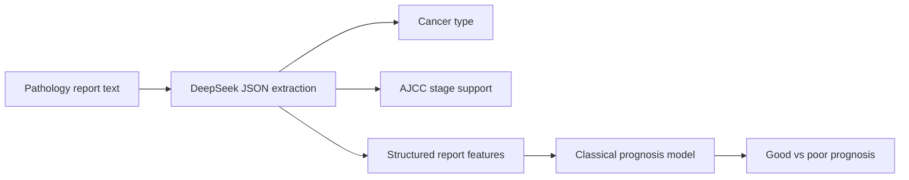

# Manuscript Outline

## Proposed Title

DeepSeek for Pathology Report Understanding: A Benchmark Study of Cancer Type Extraction, AJCC Staging, and Prognosis Prediction

## Core Thesis

DeepSeek performs extremely well on pathology information extraction and strongly on AJCC stage prediction when reasoning-mode prompting is used. However, prognosis prediction remains difficult for LLM prompting, and a dedicated local machine-learning classifier substantially outperforms DeepSeek prompting on the prognosis task.

## Contributions

1. First independent benchmark of DeepSeek on the PathRep-Bench pathology tasks.
2. Demonstration that DeepSeek matches leading proprietary models for cancer-type identification.
3. Demonstration that DeepSeek provides strong AJCC stage prediction using reasoning-mode prompting.
4. Evidence that prognosis prediction remains challenging for LLMs, even with few-shot prompting.
5. A hybrid architecture recommendation: DeepSeek for extraction and staging support, classical ML for prognosis prediction.

## Suggested Abstract Structure

Background:
Pathology reports contain clinically important cancer information, but unstructured report text makes large-scale reuse difficult.

Objective:
Evaluate DeepSeek across cancer type extraction, AJCC staging, and prognosis prediction, and test whether a non-LLM supervised model is better suited for prognosis.

Methods:
Use the PathRep-Bench/TCGA pathology report splits. Evaluate DeepSeek with JSON-constrained prompting, non-thinking mode for cancer type identification, and reasoning mode for AJCC staging and prognosis. Compare prognosis prompting with a local TF-IDF plus structured-feature logistic regression classifier.

Results:
DeepSeek achieved 0.9800 accuracy and 0.9778 macro F1 for cancer type identification. For AJCC staging, DeepSeek achieved 0.8165 accuracy and 0.7841 macro F1 on 594 labeled test reports. Prognosis prompting was weak, improving from 0.5300 accuracy in zero-shot mode to 0.5700 accuracy with 8 examples. A local TF-IDF text-only logistic regression classifier achieved the highest prognosis point estimate, with 0.8571 accuracy and 0.8543 macro F1. Adding DeepSeek-extracted structured variables reduced prognosis macro F1 to 0.8394, but the paired difference was not statistically significant. These results suggest that the raw pathology report text already captures much of the prognostic information available in this benchmark dataset under the evaluated modeling framework.

Conclusion:
DeepSeek is a strong pathology report understanding model for extraction and staging support, but prognosis prediction is better framed as a supervised outcome modeling problem.

## Paper Sections

1. Introduction
2. Related Work
3. Dataset and Tasks
4. DeepSeek Prompting Framework
5. Prognosis ML Baseline
6. DeepSeek-Assisted Prognosis Modeling
7. Cost Analysis
8. Results
9. Error Analysis
10. Discussion
11. Limitations and Clinical Safety
12. Conclusion

## Key Results Table

| Task | Method | Test rows | Accuracy | Macro F1 |
| --- | --- | ---: | ---: | ---: |
| Cancer type | DeepSeek V4 Flash, JSON prompting | 952 | 0.9800 | 0.9778 |
| Cancer type | DeepSeek V4 Pro, JSON prompting | 952 | 0.9769 | 0.9685 |
| AJCC stage | DeepSeek V4 Flash, reasoning mode | 594 | 0.8165 | 0.7841 |
| AJCC stage | DeepSeek V4 Pro, reasoning mode | 594 | 0.8098 | 0.6288 |
| Prognosis | DeepSeek V4 Flash, zero-shot | 100 | 0.5300 | 0.5083 |
| Prognosis | DeepSeek V4 Flash, 8-shot | 100 | 0.5700 | 0.5647 |
| Prognosis | TF-IDF text-only logistic regression | 952 | 0.8571 | 0.8543 |
| Prognosis | TF-IDF + structured logistic regression | 952 | 0.8529 | 0.8501 |
| Prognosis | TF-IDF + structured fields + DeepSeek variables | 952 | 0.8435 | 0.8394 |

## Recommended Figure

Create a workflow diagram:

## Main Discussion Claim

The results suggest a role separation: LLMs should be used where language understanding and flexible information extraction matter most, while prognosis should use supervised models trained directly on outcome labels.

## Additional Experiments For Reviewer Strength

1. Benchmark `deepseek-v4-pro` against `deepseek-v4-flash` for cancer type and AJCC staging.
2. Report cost per report, cost per 1000 reports, and cost per correct prediction using recorded token usage.
3. Include error tables for rectum vs colon, kidney RCC subtype, and Stage III vs Stage IV confusion.
4. Test DeepSeek-assisted ML prognosis by extracting structured pathology variables and feeding them into the local prognosis classifier.

Current AJCC Pro finding:

DeepSeek V4 Pro did not improve over V4 Flash for AJCC staging. It was slightly less accurate, produced 14 empty thinking-mode outputs, and cost substantially more. This strengthens the cost-effectiveness argument for V4 Flash.

Current cancer-type Pro finding:

DeepSeek V4 Pro also did not improve cancer-type identification. It achieved 0.9769 accuracy and 0.9685 macro F1 versus Flash at 0.9800 accuracy and 0.9778 macro F1, while costing more.

Final DeepSeek-assisted prognosis finding:

DeepSeek-assisted ML prognosis is complete. Although the TF-IDF text-only model achieved the highest prognosis point estimate, adding DeepSeek-extracted variables did not produce a statistically significant improvement. The TF-IDF text-only model reached 0.8543 macro F1, suggesting that the raw pathology report text already captures much of the prognostic information available in this benchmark dataset under the evaluated modeling framework.
